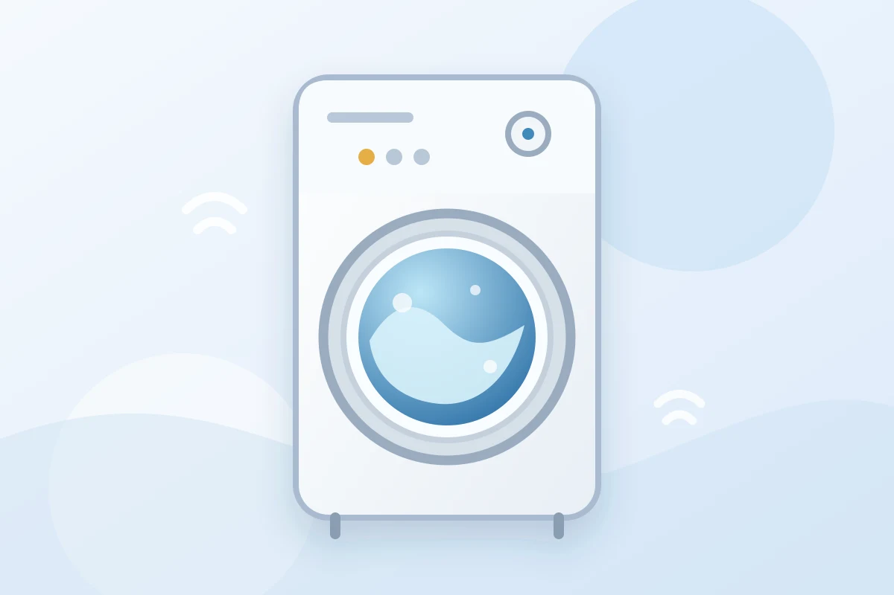

La lavadora es uno de los electrodomésticos más esenciales en cualquier hogar, pero su uso incorrecto puede llevar a problemas serios y costosos de reparar. En **Rivera Refrigeración**, hemos visto de primera mano cómo algunos errores comunes pueden afectar el rendimiento y la vida útil de las lavadoras. A continuación, te compartimos los cinco errores más comunes que debes evitar y cómo hacerlo para mantener tu lavadora en perfecto estado.

## 1. Sobrecargar la Lavadora

**Error:** Uno de los errores más comunes es sobrecargar la lavadora con demasiada ropa en un solo ciclo. Aunque puede parecer una forma de ahorrar tiempo, sobrecargar la máquina puede dañar el motor, los rodamientos, y otros componentes esenciales.

**Cómo Evitarlo:**

- Consulta siempre el manual de tu lavadora para conocer la capacidad de carga recomendada.
- Asegúrate de no llenar el tambor más de tres cuartas partes de su capacidad. Esto permitirá que la ropa se mueva libremente y se lave de manera más efectiva.

**Consejo Adicional:** Si notas que tu lavadora se mueve demasiado o hace ruidos fuertes durante el ciclo de centrifugado, es posible que la estés sobrecargando. Reduce la carga para evitar daños.

## 2. Usar Demasiado Detergente

**Error:** Utilizar más detergente del necesario no solo es un desperdicio de producto, sino que también puede provocar la acumulación de residuos en el tambor y los conductos de la lavadora. Esto puede causar malos olores y afectar el rendimiento de la máquina.

**Cómo Evitarlo:**

- Sigue las recomendaciones del fabricante de tu lavadora y del detergente en cuanto a la cantidad de producto a usar.
- Considera usar detergentes de alta eficiencia (HE) si tu lavadora es de este tipo. Estos detergentes generan menos espuma y son más efectivos para máquinas de bajo consumo.

**Consejo Adicional:** Realiza un ciclo de limpieza con vinagre blanco una vez al mes para eliminar cualquier acumulación de detergente y mantener tu lavadora limpia y en buen estado.

## 3. No Nivelar Correctamente la Lavadora

**Error:** Instalar una lavadora en una superficie desnivelada puede causar vibraciones excesivas, ruidos fuertes durante el uso, y desgaste prematuro de los componentes internos.

**Cómo Evitarlo:**

- Utiliza un nivel de burbuja para asegurarte de que la lavadora esté perfectamente nivelada antes de instalarla.
- Ajusta las patas de la lavadora para nivelarla correctamente y asegurarte de que esté estable durante el uso.

**Consejo Adicional:** Colocar la lavadora sobre una alfombra de goma o una base antivibración puede ayudar a reducir el ruido y las vibraciones, protegiendo tanto la lavadora como el suelo.

## 4. Ignorar el Mantenimiento Regular

**Error:** Muchas personas no realizan un mantenimiento regular de su lavadora, lo que puede llevar a problemas como la acumulación de moho, obstrucciones en los filtros, y piezas desgastadas.

**Cómo Evitarlo:**

- Limpia el tambor de la lavadora y la goma de la puerta regularmente para evitar la acumulación de moho y bacterias.
- Revisa y limpia el filtro de drenaje cada pocos meses para asegurarte de que no haya obstrucciones que puedan afectar el funcionamiento.

**Consejo Adicional:** Considera programar un servicio de mantenimiento profesional con **Rivera Refrigeración** al menos una vez al año para revisar y mantener todos los componentes de tu lavadora en perfecto estado.

## 5. No Revisar los Bolsillos de la Ropa

**Error:** Objetos olvidados en los bolsillos, como monedas, clips o papeles, pueden causar bloqueos, dañar el tambor de la lavadora o incluso romper componentes internos importantes.

**Cómo Evitarlo:**

- Revisa siempre los bolsillos de toda la ropa antes de colocarla en la lavadora.
- Saca cualquier objeto que pueda quedar atrapado o dañar la máquina durante el ciclo de lavado.

**Consejo Adicional:** Utiliza bolsas de lavandería para prendas delicadas o pequeños objetos que puedan soltarse durante el lavado, protegiendo tanto la ropa como la lavadora.

## Si necesita revisar su lavadora

Si la lavadora presenta una falla, Rivera Refrigeración presta el servicio de
[reparación de lavadoras en Cali](/servicios/lavadoras/). En la visita se
explica el diagnóstico y se entrega el presupuesto antes de empezar.

Para coordinar una visita, llame al +57 317 309 5159 o escriba por WhatsApp.

[Agende su visita por WhatsApp](https://wa.me/573016963313).
