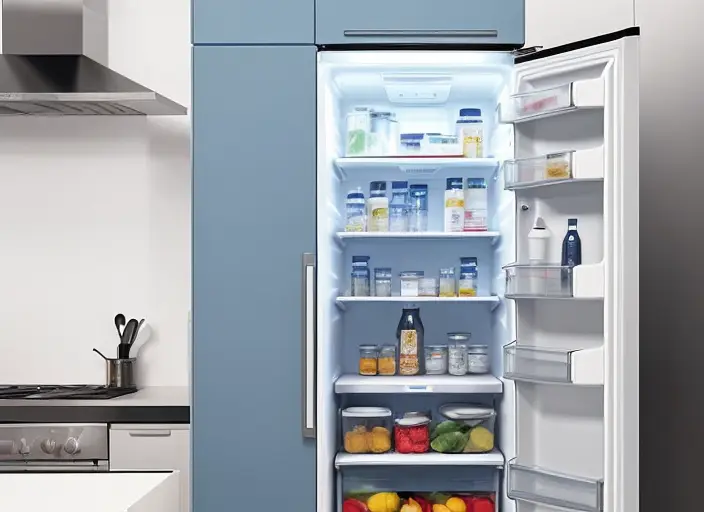

Una nevera es un electrodoméstico fundamental en cualquier hogar, y mantenerla en buen estado es clave para conservar tus alimentos frescos y evitar gastos innecesarios. Sin embargo, es común que con el tiempo presente fallas que, si no se detectan a tiempo, pueden causar problemas mayores. En **Rivera Refrigeración**, te ayudamos a identificar las señales de que tu nevera necesita reparación o mantenimiento, y te ofrecemos soluciones rápidas y profesionales.

A continuación, te mostramos las señales más comunes que indican que tu nevera necesita atención urgente:

## 1. La Nevera No Enfría Bien

Uno de los problemas más evidentes es cuando la nevera deja de enfriar como debería. Si tus alimentos no se mantienen lo suficientemente fríos o se están dañando más rápido de lo normal, puede ser un signo de que algo anda mal.

**Posibles causas:**

- El compresor está fallando.
- El termostato no está funcionando bien.
- Problemas con el sistema de refrigeración (baja presión del gas refrigerante).

## 2. Exceso de Hielo en el Congelador

¿Tu congelador parece estar cubierto de una capa gruesa de hielo? Este es un signo claro de que algo no está funcionando bien. Aunque las neveras más antiguas necesitan ser descongeladas manualmente, las más modernas están diseñadas para evitar este problema.

**Posibles causas:**

- El sistema de descongelación automática está fallando.
- El termostato no está regulando bien la temperatura.

## 3. La Nevera Hace Ruidos Extraños

Es normal escuchar un leve zumbido en la nevera, pero si de repente escuchas sonidos fuertes, chirridos o golpes, es posible que haya una pieza interna dañada.

**Posibles causas:**

- El ventilador del condensador está dañado.
- El motor del compresor está fallando.
- Alguna pieza suelta está provocando vibraciones inusuales.

## 4. La Nevera Tiene Fugas de Agua

Si notas charcos de agua alrededor de tu nevera o goteos en el interior, este es un problema que no debes ignorar. Las fugas de agua pueden ser causadas por múltiples factores y pueden dañar tanto el electrodoméstico como el piso de tu hogar.

**Posibles causas:**

- El sistema de drenaje está bloqueado.
- Las mangueras de agua están sueltas o dañadas.
- La bandeja de goteo está llena o rota.

## 5. Los Alimentos se Congelan en la Nevera

Si encuentras que los alimentos se están congelando en áreas que no deberían, esto indica un problema con el control de temperatura de la nevera.

**Posibles causas:**

- El termostato está defectuoso.
- Los conductos de ventilación están obstruidos.
- El ventilador de evaporación no está funcionando adecuadamente.

## 6. Aumento en el Consumo de Energía

¿Has notado un aumento significativo en tu factura de energía? Una nevera que está trabajando más de lo necesario puede estar consumiendo más electricidad de lo habitual.

**Posibles causas:**

- El compresor o los ventiladores están forzando su funcionamiento.
- El sellado de la puerta no está funcionando correctamente, permitiendo la salida de aire frío.

## Cuándo solicitar una revisión

Si observa alguno de estos síntomas, anote cuándo aparece y qué parte del
equipo afecta. Rivera Refrigeración presta el servicio de
[reparación de neveras en Cali](/servicios/neveras/) y explica el diagnóstico
antes de proponer un trabajo.

## Solicite una revisión

Para coordinar una visita, llame al +57 317 309 5159 o escriba por WhatsApp.

[Agende su visita por WhatsApp](https://wa.me/573016963313).
